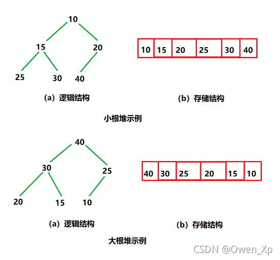

[TOC]
## python
### collections中defaultdict：一种内置字典子类
```python
from collections improt defaultdict
# 使用list作为default_factory
d = defaultdict(list)

# 当key不存在时，defaultdict会自动为这个key创建一个新的空列表
d['a'].append(1)
d['a'].append(2)
d['b'].append(3)

print(d)  # 输出：defaultdict(<class 'list'>, {'a': [1, 2], 'b': [3]})

# 使用int作为default_factory
d = defaultdict(int)

# 当key不存在时，defaultdict会自动为这个key创建一个新的实例
d['a'] = 1
d['b'] = 3

print(d)  # 输出：defaultdict(<class 'int'>, {'a': 1, 'b': 3})
```
### set()函数的用法：创建一个无序但不含重复元素的集合
```python
# 创建一个空的集合
s = set()
print(s)  # 输出：set()

# 从列表创建集合，自动去除重复元素
s = set([1, 2, 3, 2, 1])
print(s)  # 输出：{1, 2, 3}

# 从字符串创建集合，自动去除重复字符
s = set('hello')
print(s)  # 输出：{'e', 'h', 'l', 'o'}
```
set()对象中的元素是可哈希的，可以在O（1）的时间复杂度进行增删查改

### python中字典的一些操作
删除操作：.pop()和del
```python
a = {}
a["fasd"] = 1
a["dsfa d"] = 2
print(a)
#{'fasd': 1, 'dsfa d': 2}
del a["fasd"]
a.pop("dsfa d")
print(a)
#{}
```
使用len(),key(),value(),items()分别返回字典长度、键列表、值列表、键值对元组
```python
a = {}
a["fasd"] = 1
a["dsfa d"] = 2
for key in a.keys():
    print(key)
# fasd dsfa d
```
添加键值对，若该键存在则将值加一，常用于统计
get(key, 0)的作用是返回该键对应的值，若没有该键则返回零
```python
dict = {}
dict["new_key"] = dict.get(new_key, 0) + 1
```
collections.Counter()用法，输入一个列表，输出字典，值为键数字出现的次数
```python
import collections
nums = [1, 2, 3, 4, 5, 6, 7, 8, 9, 10, 1, 2, 3, 4, 5]
nums = collections.Counter(nums)
print(nums)#Counter({1: 2, 2: 2, 3: 2, 4: 2, 5: 2, 6: 1, 7: 1, 8: 1, 9: 1, 10: 1})
```
## 数据结构及算法
### 异或（^）操作
异或是一种二进制的位运算，符号以 XOR 或 ^ 表示。
相同为0，不同为1，即
1 ^ 1 = 0
0 ^ 0 = 0
1 ^ 0 = 1

可以用于将两个变量值互换
```python
// 常规方法
int temp = a;  // temp = 3
a = b;         // a = 7
b = temp;      // b = 3
 
// 异或方法
a = a ^ b;  // a = 3 ^ 7
b = a ^ b;  // b = (3 ^ 7) ^ 7 = 3 ^ (7 ^ 7) = 3
a = a ^ b;  // a = (3 ^ 7) ^ (3 ^ 7 ^ 7) = (3 ^ 3) ^ (7 ^ 7) ^ 7 = 7
```


异或还满足以下规律
（1）交换律： A ^ B = B ^ A

（2）结合律： ( A ^ B ) ^ C = A ^ ( B ^ C )

（3）自反性： A ^ B ^ B = A （由结合律可推： A ^ B ^ B = A ^ ( B ^ B ) = A ^ 0 = A）

由运算规则可知，任何二进制数与零异或，都会等于其本身，即 A ^ 0 = A。
因此可以用来筛选偶数次重复的变种
0 ^ A = A, A ^ B ^ A = B
### 堆
将一个数组元素按照完全二叉树的顺序储存在一维数组中，且满足所有双亲节点都比子节点数值小（大）的叫做小（大）堆

python中将一个列表创建为堆，默认为小堆，即堆顶的为最小元素，可对所有元素进行取相反数操作获得大堆
```python
import heapq
nums = [1,3,-1,-3,5,3,6,7]
heapq.heapify(nums)
print(nums)#[-3, 1, -1, 3, 5, 3, 6, 7]
heapq.heappush(nums, -5)#[-5, 1, -3, 3, 5, 3, 6, 7, -1]
a = heapq.heappop(nums)
print(a)#-5


nums = [1,3,-1,-3,5,3,6,7]
nums = [-x for x in nums]
heapq.heapify(nums)
print(nums)#[-7, -3, -6, -1, -5, -3, -1]
a = -heapq.heappop(nums)
print(a)#7

```
也可以以元组或列表为元素创建为堆，元组中第一个元素用于确定元组在堆中的位置
```python
nums = [42,325,214,5426,32,54,1235,23,53,2,57,3]
q = [(-nums[i], i) for i in range(len(nums))]
heapq.heapify(q)
print(q)#[-5426, 3, -1235, 6, -325, 1, -214, 2, -53, 8, -54, 5, -42, 0, -32, 4, -23, 7, -3, 10, -2, 9, -57, 11]
```